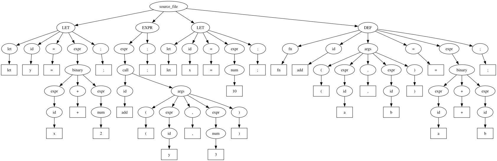

# alcalc
tree sitterを利用した前方宣言可能な簡易的な計算機

<!--変数の依存解決の練習のために前方宣言可能とした-->

コンパイラの理解のために作った

~~yacc とかでいいのでは~~

# 機能
1. 四則演算
2. 変数定義
3. 関数定義
4. 自動で依存関係を整理して実行順序を決定

# 構文木

```
let y = x + 2;
add(y, 3);
let x = 10;
fn add(a, b) = a + b;
```


